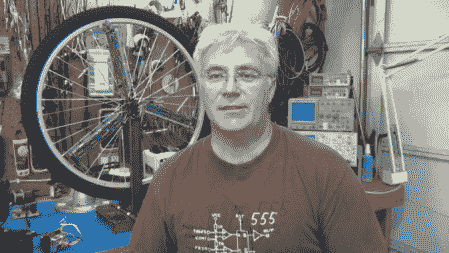

# 托德·哈里森的 EEWeb 采访

> 原文：<https://hackaday.com/2011/12/04/an-eeweb-interview-with-todd-harrison/>

虽然托德·哈里森可能是我们众多读者中的一员(也可能是我们大多数作家中的一员)，但很高兴看到[ [EEWeb](http://www.eeweb.com/spotlight/interview-with-todd-harrison) ]中出现了一个“我们”。[HAD]以前在一些帖子中提到过他，比如最近这篇关于更换[焊片电池](http://hackaday.com/2011/11/26/replacing-solder-tab-batteries/)的帖子。

许多人可能感兴趣的是，[托德]毕业后不久就找了一份电脑程序员的工作，但像许多其他兼职制造者一样，他仍然需要亲自创造和修改东西。这篇文章介绍了他喜欢的一些工具，以及他已经完成或正在进行的一些项目。

在这篇文章中，[托德]谈到了他认为激励新一代工程师面临的最大挑战。其中之一是电路越来越被锁定，不容易修补。在没有探究事物如何运作的情况下，他的观点是很少有人会被激励去从事工程。尽管他的观点肯定有些道理，但随着一些大门关闭，其他大门有望打开。互联网的可访问学习环境、开源资源和许多像 Arduino 这样的制造商友好的材料应该有助于填补空白。

为了获得更多信息，[托德]也有自己的博客，[Toddfun.com](http://www.toddfun.com/)，专门介绍他的项目。