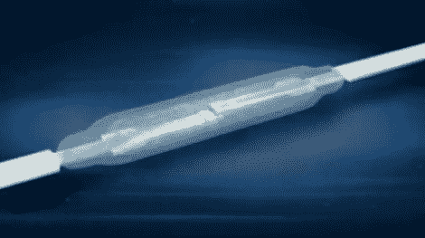

# 簧片开关制造过程的内部观察

> 原文：<https://hackaday.com/2012/03/14/an-inside-look-on-how-reed-switches-are-manufactured/>

[York]写信给[分享他在研究簧片开关和继电器时偶然发现的一个视频，该视频记录了生产它们的严格控制的过程。像许多其他电子元件一样，我们通常不会过多考虑它们是如何制造的，尤其是当最终成本相对较低时。](http://www.elektronika.ba/831/how-reed-switches-are-made/)

对于一些经常被认为是理所当然的事情来说，这个过程是一个非常精确的过程，需要一个干净的房间环境。该视频从头到尾跟踪了生产线，包括触点的软退火以消除剩磁，在触点上涂覆亚微米厚导电涂层的溅射过程，以及对构成开关主体的玻璃管进行激光切割和密封。

在一天结束时，这个视频只不过是一个制造商的宣传视频，但它值得花 8 分钟来观看，如果只是为了满足你对它们是如何制作的好奇心。

[https://www.youtube.com/embed/FhUt7VyMKT4?version=3&rel=1&showsearch=0&showinfo=1&iv_load_policy=1&fs=1&hl=en-US&autohide=2&wmode=transparent](https://www.youtube.com/embed/FhUt7VyMKT4?version=3&rel=1&showsearch=0&showinfo=1&iv_load_policy=1&fs=1&hl=en-US&autohide=2&wmode=transparent)