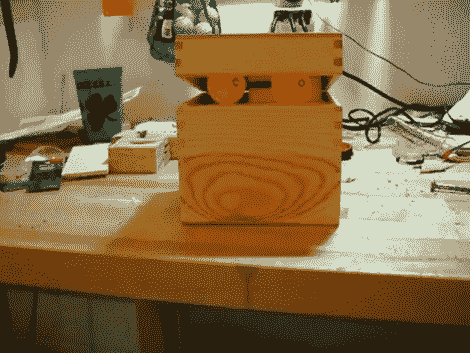

# 一个奇怪的小盒子

> 原文：<https://hackaday.com/2011/05/23/an-odd-little-box/>

这里有一个奇怪的小盒子，可能会为即将到来的万圣节带来创意。[杰里米的]令人毛骨悚然的发光盒子有一双乒乓球眼，可以散射一对发光二极管发出的红光。盖子和眼睛都会移动，整个装置都是无线控制的。

大部分零件来自[杰里米]放在垃圾箱里的玩具遥控直升机。经过仔细检查，他发现电子设备包括两个旋翼的电机驱动器，以及两个用于操纵飞机的伺服电机。其中一个伺服系统已经被重新用于瞄准眼睛的左右方向，另一个伺服系统用于抬起和关闭盒子的盖子。剩下两个电机控制器，其中一个开关 led。另一个还没有真正的目标。他试着给盒子加了一个轮子，但是打开它只会让整个东西撞到地板上。看看他到目前为止在折叠后的剪辑中做了什么。

[https://www.youtube.com/embed/uW5EJm_ze98?version=3&rel=1&showsearch=0&showinfo=1&iv_load_policy=1&fs=1&hl=en-US&autohide=2&wmode=transparent](https://www.youtube.com/embed/uW5EJm_ze98?version=3&rel=1&showsearch=0&showinfo=1&iv_load_policy=1&fs=1&hl=en-US&autohide=2&wmode=transparent)