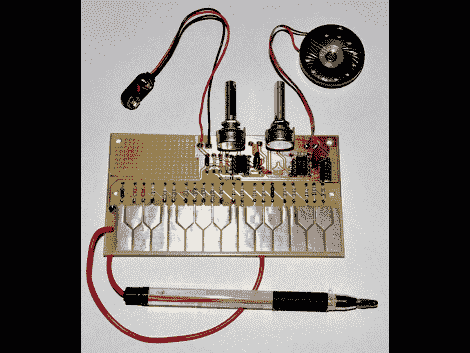

# 模拟唱针

> 原文：<https://hackaday.com/2010/09/23/analog-stylophone/>

道格·杰克逊刚刚完成了一台模拟唱机的制作。我们以前见过这种乐器几次，最近一次是带有基于 Arduino 的控制器的[，但这一次使用 555 定时器、电阻器和电位计来生成每个音符的波形。如果你有覆铜板和蚀刻电路板的方法，其他的东西应该很容易得到。我们确实注意到，由于这是一个单面电路板，您将在元件的同一侧焊接，这可能有点棘手，但易于管理。我们只是希望[道格]已经发布了一个演示视频，这样我们就可以听到这听起来像什么。但是它和使用 555 定时器的](http://hackaday.com/2009/08/25/arduino-based-synthesizer/)[电子呜呜祖拉](http://hackaday.com/2010/07/13/electronic-vuvuzela/)不会有太大的不同。