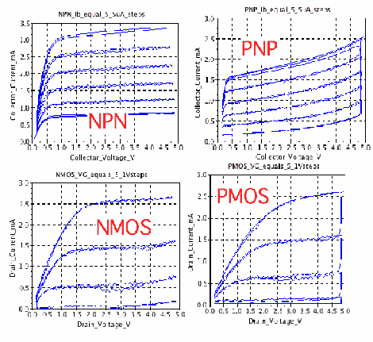

# 计算机的模拟测试接口

> 原文：<https://hackaday.com/2011/10/20/analog-test-interface-for-your-computer/>

想要测试一些模拟部件的响应曲线，[Don Sauer]设计了一种方法，使用简单的工具在计算机上绘制模拟测试图。这里你可以看到测试 NPN、PNP、NMOS 和 PMOS 晶体管的结果，但是修改输入电路可以让你测试任何你想要的东西。

[Don]正在使用 Arduino 作为硬件接口。他需要一些额外的器件，比如运算放大器和一些无源器件。他没有在试验板上制作，而是在一张硬纸板上打印出电路，用热胶水将元件粘在适当的位置，然后用电线连接起来。这将让他在未来重用接口，但比设计和蚀刻 PCB 更快。

他使用处理草图来捕获从 Arduino 流入的测试数据。一旦记录下来，他就使用 [SciLab](http://en.wikipedia.org/wiki/Scilab) 来创建图表。他还介绍了一种使用 [Octave](http://en.wikipedia.org/wiki/GNU_Octave) 筛选数据的方法，这是另一种感觉有点像 MATLAB 的开源程序。