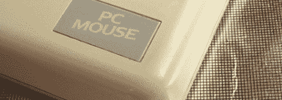

# 古老的老鼠拆卸和修复

> 原文：<https://hackaday.com/2012/01/07/ancient-mouse-teardown-and-repair/>

对于 80 年代的年轻极客来说，it 电脑就是 IBM 的 PCjr。从理论上讲，这是一次真正意义上的技术飞跃。它配有无线键盘、光笔和光电鼠标，这是一款令人印象深刻的硬件，尽管它遭到了恶意中伤。不过，光电鼠标有一个小问题；它需要一个特殊的鼠标垫。PCjr 爱好者[Michael]决定[制作自己的](http://www.brutman.com/Mouse_Systems_Optical_Mouse/Mouse_Systems_Optical_Mouse.html)光学鼠标垫。它很好用，而且比找一辆二手的出售要容易得多。

PCjr 鼠标使用两个光电探测器——一个红色 LED 和光电探测器用于水平轴，一个红外 LED 设置用于垂直轴。光线穿过鼠标底部的两个孔，反射回光电探测器。[Michael]用一张铝箔和一张印有网格图案的透明胶片模仿了老式鼠标垫。当然没有原件那么优雅，但它仍然起了作用。

这个聪明的光学鼠标装置并不局限于地位低下的 PCjr。许多旧的 Sun 工作站有类似的设置，在鼠标垫上使用小点。有几代鼠标垫通常彼此不可比(因为一种类型的鼠标垫对 Sun 来说不够专有)，但我们会假设类似的构建会对这些被遗忘的鼠标起作用。

感谢[乔希]送来这封信。