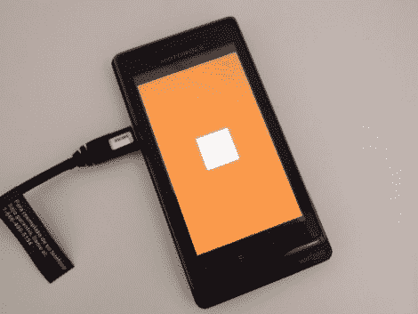

# 使用处理的 Android 应用程序

> 原文：<https://hackaday.com/2010/10/02/android-apps-using-processing/>

处理已经来到了 Android。[Jer]发布了一个安装软件和[为 Android](http://blog.blprnt.com/blog/blprnt/processing-android-mobile-app-development-made-very-easy) 编写第一个处理应用的指南。支持谷歌移动操作系统的模块还不是稳定处理版本的一部分，但它可以工作，并且可以在[下载和使用](http://code.google.com/p/processing/downloads/list)。它提供了对 Android 版本和更新版本的支持，很好地与 SDK 一起在开发过程中模拟你的草图。上面看到的 Hello World 应用程序只用了几行代码就在橙色背景上画出了一个白色的盒子。安装并测试工具后，您可以立即开始开发。

这给你的 Android 开发工具包增加了一个很好的补充。

[感谢技术 B]