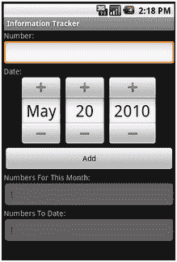
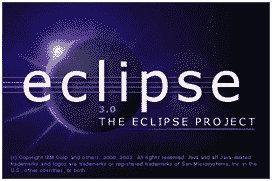

# Android 开发 101——系列教程

> 原文：<https://hackaday.com/2010/07/12/android-development-101-%e2%80%93-a-tutorial-series/>

Android 是当今开发应用程序的主要操作系统，原因有很多。主要原因是它是开源的和直观的。此外，它使用 Java 进行开发，这是一种很容易习惯和开发的语言。也就是说，你们中的很多人对 Android 应用程序或一般应用程序有很好的想法，但不知道从哪里开始。本系列将带您深入幕后，向您介绍在为 android 开发时将成为您最好朋友的软件。在这个旅程中，我们将从“Hello World”开始，并从那里继续创建一个具有触摸和滚动界面的数据库驱动的应用程序。最终结果看起来会像这样:

使用工具开发 Android 应用程序将是你最大的财富，因为你很早就会意识到这一点。我使用的所有工具将被列出来，以使开发快速有效，同时仍然看起来很好。最好的情况是你需要获得 Eclipse，我推荐 Eclipse IDE for Java EE Developers 版本，因为它对于其他类型的开发来说也是惊人的。你将得到的下一个工具是 [Android SDK](http://developer.android.com/sdk/index.html) ，它允许你将 SDK 与 eclipse 挂钩，以引用它的 API 并设计一个高效运行的程序。之后，这一部分是可选的，看看 [DroidDraw](http://www.droiddraw.org/) ，它本质上是一个 GUI，用于设计界面方面的东西，这样你就不必盲目地在 Android SDK 和 Java 丛林中摸索前进。

Eclipse 的设置和开始使用 Android SDK 相当简单，您只需下载一个包，将 SDK 包含到 eclipse 引用的文件中。为此，我们将前往**帮助**，然后前往**安装新软件**。我们想点击**添加**，以便能够查找他们希望我们下载的谷歌软件包。在位置字段输入**[https://dl-ssl.google.com/android/eclipse](https://dl-ssl.google.com/android/eclipse)**并点击确定。选中这两个框并进入下一个屏幕。在继续之前，您应该确保 **Android DDMS** 和 **Android 开发工具**都已列出。接受许可协议，然后单击完成。您将不得不重启 Eclipse，但是在那之后，您的挂钩就可以设置好了。

Android SDK 对于任何系统来说都很容易下载，但是更新它并将其连接到 Eclipse 才是关键。下载 zip 文件后(我使用的是 Windows/Linux，但 Windows examples 将是默认的)，将其解压缩到 c 盘，并标记它将进入的文件夹 AndroidSDK。进入该文件夹后，双击设置图标，将带您进入显示所有可供下载的更新的屏幕。下载最新的更新，并进入顶部选项**虚拟设备**，在这里您将制作您的第一个仿真器。注意:如果没有显示更新列表，您必须将安装客户端设置为使用 http 而不是 https。创建模拟器时，名称并不重要，您真正需要设置的是您想要开发的版本。我们将从列表中选择 Android 1.5，因为如果你决定推广一个应用程序，你可以接触到更多的人，对于我们将使用的 API，我们不需要 2.1 或 2.2。设置好模拟器后，您就可以让这两个人第一次见面了。

进入 Eclipse，你将点击**窗口**按钮，导航到**首选项**选项并点击它。选择左边的 Android 选项，在窗口的右边会出现一个带有浏览按钮的空白屏幕。点击按钮，在 c 盘找到你的 AndroidSDK 目录，选择那个文件夹。点击**应用**将会让你正在看的空白窗口显示许多不同版本的 Android SDK，如果你能看到它，你就在正确的轨道上。点击**确定**，我们准备开始开发。

注意:DroidDraw 将在本系列的另一篇文章中讨论，我们将使用它来制作我们界面的一部分，另一半我们将自己编写代码。对于其他开发 Linux 的人来说，我已经找到了一个很棒的帖子，它将描述如何为 Ubuntu 设置你的环境，并且可能会转换到 Red Hat 等。任何有困难的人都可以让我知道你遇到的问题，我会尽我所能在下一篇文章之前不把你落下。

如果你等不及下一篇文章，请浏览 [Android 开发者网站](http://developer.android.com/resources/index.html)上的示例。

用于参考的文章:

Android 开发人员—[安装 ADT 插件](http://developer.android.com/sdk/eclipse-adt.html)

继续进入[第 1 部分，Hello world](http://hackaday.com/2010/07/15/android-dev-101-%E2%80%93-part-1hello-world/) 。

43.002684-81.21499