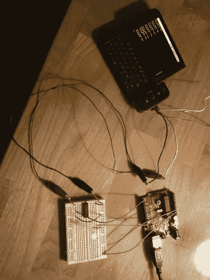

# Android G1 串行到 Arduino

> 原文：<https://hackaday.com/2010/01/25/android-g1-serial-to-arduino/>

有了对这些我们称之为手机的新的强大硬件的根访问的能力，我们有点惊讶我们没有看到更多与外部硬件的接口。这里有一个 Android G1 和 Arduino 之间一些基本连接的例子。要做到这一点，您必须将您的 G1 作为根，安装 Android SDK，然后运行一个定制的 python 程序。还有一个从 3.3v 到 5v 的简单电平转换器，用于连接 Arduino。你可以从说明书上了解所有的细节。他们很好地记录了这个过程，我们很兴奋地看到人们想出了什么样的东西。