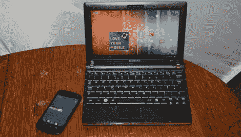

# 上网本上的 Android

> 原文：<https://hackaday.com/2012/03/28/android-on-your-netbook/>

看起来有一种非常简单的方法可以在你的上网本上安装最新版本的安卓系统[。实际上，这仅限于一些类型的硬件，包括像 eeePC 这样的上网本。这是因为安装过程中使用的 ISO 文件是为这些设备上使用的硬件量身定制的。与其他 Linux 发行版一样，](http://www.mobilefun.co.uk/blog/2012/03/android-4-0-ice-cream-sandwich-on-a-netbook-part-1-install/)[ISO 文件可以使用 Unetbootin](http://hackaday.com/2008/10/30/battle-of-the-thumb-drive-linux-distros/) 加载到拇指驱动器上。从那里，你可以给它一个旋转作为一个活的 CD(或 USB)或选择安装在你的硬盘上。由于 eeePC 版本不想在我们的 Dell Mini 9 上启动，我们还没有考虑这个问题，但是我们看不出为什么不能将其设置为双启动选项。

现在，你为什么想在你的上网本上运行 Android 呢？我们已经看到有一种方法可以在 Ubuntu 中运行 Android 应用。我们打赌有些人只是喜欢 Android，而有些人只是讨厌 Ubuntu 现在使用的 Unity 桌面……尤其是当[的上网本混音版](http://hackaday.com/2009/10/29/ubuntu-9-10-karmic-koala/)有很多优点的时候。