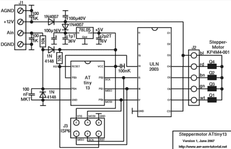

# 宣布我们的下一个主题:ATtiny Hacks

> 原文：<https://hackaday.com/2011/09/12/announcing-our-next-theme-attiny-hacks/>

又到了宣布新主题的时候了。这一次，我们选择突出围绕 ATtiny 系列处理器构建的项目。这些是 6 至 32 引脚 AVR 处理器，运行频率最高可达 16 MHz，具有 512 字节闪存和 32 字节 RAM，以及 16K 闪存和 512 字节 RAM。我们猜测这将是一个非常受欢迎的主题，因为这些天有很多人在使用 Atmel 处理器。如果你有一个项目想在 Hackaday 上看到，这个项目使用的是 ATtiny 处理器，[请打我们的热线](http://hackaday.com/contact-hack-a-day/)。如果我们喜欢它，我们可以选择在我们的日常主题之一。

为了揭开这个主题，这里有一篇关于基于 attin i3 的步进电机驱动器的精彩文章。该项目读取引脚 B4 上的模拟值，并调整步进电机的速度。它是有据可查的，包括源代码。