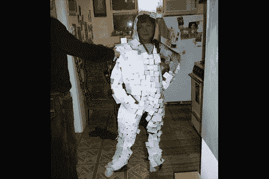

# 匿名服装

> 原文：<https://hackaday.com/2008/06/17/anonymizing-clothing/>

虽然【citizenFinerran】设计[一套服装，将穿着者伪装起来，不让安全摄像头拍到](http://www.instructables.com/id/Finally-Im-being-recognized/)的意图很有哲理性，但它的设计有着非常明确的目的。这套服装不能提供真正的伪装(更不用说真正的隐形了)，但它确实创造了足够多的移动视觉障碍，使穿着者在电影中完全匿名。休息之后，我们将为您带来更多关于这件和其他隐形衣的细节。

这个想法非常简单:[citizenFinerran]的西装是由一件用玻璃纤维筛选制成的连身衣制成的，几张空白身份证对半分开，粘在西装上。这些卡片并没有牢牢地粘在一起，而是以一种可以随着佩戴者的行走而移动的方式悬挂着。卡片的运动产生了一种视觉效果，在监控录像中表现为像素化。虽然设计者参考并“模仿”了几种不同的创建像素化外观的方法，但所有这些方法实际上都是通过相机上的软件实现的，而不是通过外部硬件解决方案。目前，东京大学的一组学生和教授研发出了最接近工作隐形斗篷的东西。它使用了由反光材料制成的外套，穿戴者背后的摄像机和投影仪。数码相机捕捉佩戴者身后的风景，并将其投射到前方，在不透明的表面上创建一种伪装形式，类似于真正的隐形。不过，这并不是没有限制，因为投影仪必须随着穿着外套的人移动才能实现移动覆盖。即使这样，它也只能在外衣的一面起作用，而另一面则完全暴露在外。除非创造出全身展示，否则不太可行。

如果躲避摄像头是我们的目标，我们觉得一个更优雅的解决方法就是[用头罩遮住脸](http://www.boingboing.net/2005/10/08/hoodie-sweatshirts-w.html)或者[用防毒面具](http://safeliving.wordpress.com/2007/12/13/goggle-jackets-are-the-new-hoodies/)。除了对你的身份保密之外，兜帽实际上非常符合[citizenFinerran]项目背后的哲学要求，而且不太可能让你挨揍。

*   [永久链接](http://www.instructables.com/id/Finally-Im-being-recognized/)