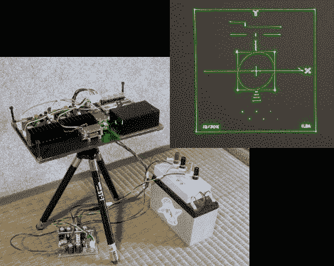

# 另一个自制的激光投影仪

> 原文：<https://hackaday.com/2010/08/22/another-home-built-laser-projector/>

[Jarrod]在昨天看到我们[展示的另一款投影仪后，给了我们一个这个](http://hackaday.com/2010/08/21/vector-plotter-with-lasers/)[自制激光投影仪](http://elm-chan.org/works/vlp/report_e.html)的链接。这个系统是完全不同的。几年前完成这个项目的[ChaN]没有使用扬声器来移动镜子，而是建造了自己的闭环检流计。其中两个由 ATmega64 控制，以产生令人难以置信的干净和准确的矢量图像。令人印象深刻的不仅仅是图像，他的硬件布局技巧娴熟，深谋远虑，将它藏在箱子里是一种亵渎。