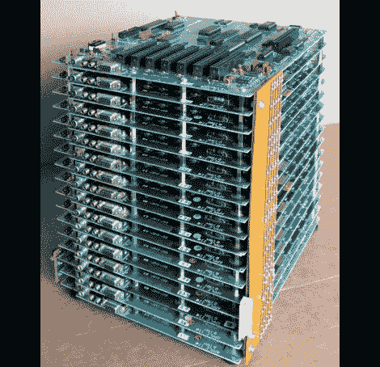

# appreciate ii 让集群计算乐趣倍增

> 原文：<https://hackaday.com/2011/05/04/applecrate-ii-doubles-the-cluster-computing-fun/>

早在 2004 年，苹果爱好者/大师[迈克尔·马霍]建造了一组被称为“苹果箱”的苹果主板，作为并行计算的实验。现在几年过去了，[他带着这款设备的新版本回来了，被恰当地命名为 AppleCrate II](http://home.comcast.net/~mjmahon/AppleCrateII.html) 。

AppleCrate II 的建立是为了解决他的第一个集群项目的一些设计限制[，以及扩展他的并行计算能力。他对第一个模型的不满主要是结构性的。新系统被组织成水平的层次，在每个主板之间使用金属支架，而不是依靠摇摇欲坠的木质上层结构来保持东西在一起。他还发现他以前的 8 处理器配置有点限制，所以 AppleCrate II 有 17 个节点——16 个从节点和一个专用于运行操作的主板。该集群甚至使用自己的自制网络堆栈 NadaNet 来实现电路板之间的通信。](http://hackaday.com/2005/09/02/applecrate-apple-ii-based-cluster/)

这个项目非常令人印象深刻，所以如果你想了解更多，一定要访问他的网站。他有大量的技术细节，以及他用来启动和运行集群的所有软件的副本。

[via [BoingBoing](http://www.boingboing.net/2011/05/04/parallel-machine-mad.html)