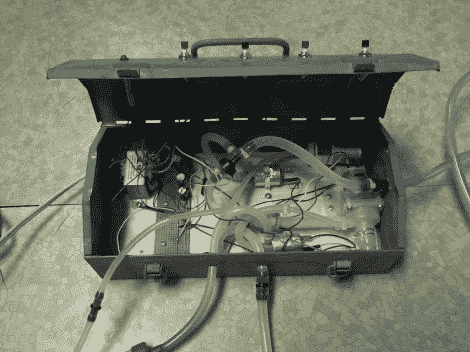

# 由 Keurig 零件制成的水族箱水交换器

> 原文：<https://hackaday.com/2012/03/21/aquarium-water-exchanger-built-from-keurig-parts/>

我们不断看到 Keurig 咖啡机的广告，这些咖啡机使用一个塑料豆荚来冲泡一杯咖啡。我们非常肯定这是一种时尚，并且绝对肯定用这种方法酿造的额外包装是一种浪费。但是人各有志。[Danman1453]有两个装置。一个是他买的，另一个是保修更换。他决定废弃这个出故障的装置，看看是否能好好利用它。他最终得到的是[你在](http://danman1453.wordpress.com/2012/03/21/fish-tank-transfer-pump/)上方看到的水族箱抽水系统。

这被认为是换出鱼缸中的水的更整洁的方法。他一直用管子虹吸水，但发现他几乎总是弄得一团糟。这个系统使用一个空气泵，通过给水箱加压使水进入管道来启动水泵。一旦水泵准备好了，他就切换到水泵上进行剩下的工作。他使用了一个旧的金属工具箱作为外壳，用盖子来安装按钮，当按下按钮时，按钮会将电源发送到各个组件。许多部件都是从咖啡机上移植过来的，但是即使你采购了所有的新部件，组装起来也不会花费太多。