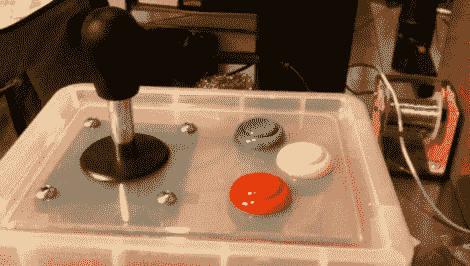

# 盒子里的街机控制器

> 原文：<https://hackaday.com/2011/09/08/arcade-controller-in-a-box/>

[Alex]想用游戏杆和按钮玩视频游戏，但在看到通过 USB 连接到计算机的商用控制器的价格后，震惊了。他开始建造他自己的，最终得到了你在上方看到的[盒中控制器。](http://brainlubeonline.com/ArcadeController/Arcade_Stick.html)

起初，他尝试使用 mbed 微控制器板，但对系统内置的延迟感到不满，该延迟检测按钮按压，通过 USB 将其作为键盘按压发送，然后被解释为游戏的输入。他完全抛弃了微控制器，选择了几个 4021 并行转串行移位寄存器。他之前用这种方法制作了自己的 SNES 控制器。SNES 使用两个 8 位移位寄存器生成一个 16 位串行数据包，发送到控制台。[Alex 的]重新使用了那个系统，给他的 arcade box 添加了一个 SNES 控制器插头，并使用他已经必须连接到计算机的 SNES 到 USB 转换器。现在他有了一个便携式控制器，只需要三个按钮、一个控制杆和两个集成电路。

在广告之后的剪辑中，他自己解释了这个项目。

[https://www.youtube.com/embed/8Xne7pEzLGI?version=3&rel=1&showsearch=0&showinfo=1&iv_load_policy=1&fs=1&hl=en-US&autohide=2&wmode=transparent](https://www.youtube.com/embed/8Xne7pEzLGI?version=3&rel=1&showsearch=0&showinfo=1&iv_load_policy=1&fs=1&hl=en-US&autohide=2&wmode=transparent)