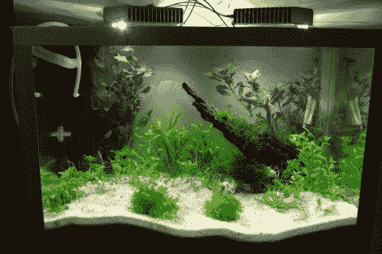

# Arduino 水族灯

> 原文：<https://hackaday.com/2012/03/26/arduino-aquarium-lights/>

[卡勒·海沃宁]刚刚完成了他自己的水族馆灯。他使用了四个强大的软白光 led，将它们安装在一对散热器上以保持冷却。现在，他可以把它们连接到电源上，插在墙上，但他包括了自己的控制器。Arduino 驱动开关模式电源，通过 PWM 提供调光功能，并使用带有备用电池的 RTC 芯片自动开关灯。草图包括通过 USB 连接发送串行命令来改变照明计划和其他变量的能力。这个协议在他的草图中有详细的注释。

我们已经看到了很多有趣的水族馆灯光项目。这个[利用发光二极管的热量来加热水](http://hackaday.com/2010/02/26/cooling-leds-by-heating-the-water-saves-on-electricity/)是我们的最爱之一。其他的充满了像[这样的功能，这个版本包括一个月光模式](http://hackaday.com/2010/01/29/salty-leds/)。但是 Arduino 爱好者不用找很远就能找到像[这种 PAR meter build](http://www.plantedtank.net/forums/diy/120109-diy-par-meter-yeah-you-heard.html) 或[这种水族馆灯光控制器库](http://www.plantedtank.net/forums/diy/147328-improved-arduino-led-lighting-code.html)这样的产品，它们可以使用无处不在的控制器板重新创建。