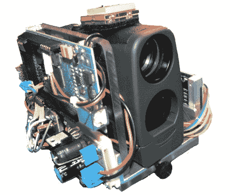

# Arduino 登陆战场——真的

> 原文：<https://hackaday.com/2011/06/07/arduino-hits-the-battlefield-for-real/>

我们不确定这是否是第一次，但这里有一些非常确凿的证据表明，Arduino 已经找到了进入战争武器的方法。创作者，[德里克·威尔士]，[约翰·艾舍]和[乔治·霍普金斯]都是西点军校电子工程专业的学生。他们是在看到阿富汗一场交火的视频片段后产生这个想法的，当时战斗士兵使用指南针和 GPS 设备呼叫炮火袭击。这是一个一体化的装置，可以快速准确地提供相同的信息。上面的原型，[，他们称之为 DemonEye](http://usarmy.vo.llnwd.net/e2/-images/2011/05/06/107770/) ，包含一个激光测距仪，数字罗盘和一个 GPS 模块。文章还称它包含一台迷你电脑，但我们认识到这是一台 Arduino Mega(感谢 [Areopago 21](http://areopago21.org/) 的 Miguel 首先注意到这一点并发送了关于它的提示)。

样机的价格显然是 1000 美元。好吧，这似乎有点高，但还不算离谱。我们无法理解的是，第二代设备是如何以 10 万美元的价格再购买 5 台的。铺设军用级 PCB 的现行价格是多少？