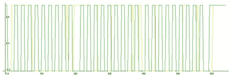

# 阿尔杜伊诺·I2C 嗅探器

> 原文：<https://hackaday.com/2011/05/21/arduino-i2c-sniffer/>

发现自己需要一个 I2C 嗅探器，但是没有。需要是发明之母，所以他为 Arduino 制作了这张 [I2C 嗅探器草图。arduino 将记录在设定的时间间隔内发生的事情，然后通过串行以. csv 格式转储数据。然后，您必须绘制它以查看发生了什么。[Johngineer]推荐](http://www.johngineer.com/blog/?p=455) [Livegraph](http://www.live-graph.org/) ，因为它便携又简单。从代码中可以看出，时间间隔是可调的，但是要考虑板上 RAM 的物理限制。这看起来像是一段非常方便的代码，在必要时可以有效地为您提供一个还过得去的 I2C 嗅探器。