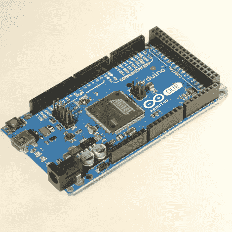

# Arduino 发布新品；帮助他们开发基于 ARM 的 Arduino

> 原文：<https://hackaday.com/2011/09/19/arduino-releases-new-products-help-them-develop-arm-based-arduino/>

Arduino 的人们利用纽约的 Maker Faire 发布了他们的新产品系列。他们的产品线增加了几个有趣的新产品。

他们已经有了一个 WiFi 盾，它利用 H&D Wireless 的模块和 AVR32 处理器来减轻 Arduino 板上 ATmega 芯片的工作负荷。它甚至有空间让你在神盾局的处理器上运行你自己的代码。

值得注意的(但我们不太感兴趣)是 IDE 的 1.0 版本和新的低成本板的开发。该硬件旨在使那些已经熟悉 Arduino 平台的人更容易开发 USB 设备。

但是，吸引我们眼球的大新闻是一个名为 Due 的 ARM Cortex-M3 Arduino(我们已经希望它被命名为不同的名称，只是因为搜索词与 Duemilanova 形成对比)。硬件还没有最终确定，虽然你可以在上图中看到一个原型。他们希望在最后的润色上得到社区的投入，所以快去帮他们一把吧！

[感谢英萨皮奥和汤姆]