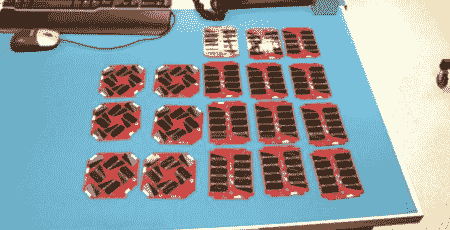

# arduinos……在…Spaaaaaace…..

> 原文：<https://hackaday.com/2011/06/20/arduinos-in-spaaaaaace/>

自 2007 年以来，[Adam Kemp]一直领导着一个来自 Thomas Jefferson 高中的学生团队，指导他们设计和建造一颗小型卫星，[NASA 选择](http://www.nasa.gov/home/hqnews/2011/feb/HQ_11-038_CubeSat.html)于明年初发射。

CubeSat 的正式名称是 TJ Sat，它的几乎所有系统都使用现成的商业组件。该团队遇到了一个与 [FM430 飞行模块](http://www.cubesatkit.com/docs/datasheet/DS_CSK_FM430_710-00252-C.pdf)接口的问题(PDF 警告)，因此【Adam】设计了一个基于 Arduino 的替代品。基于 ATMEGA328，整个电路板是 FM430 飞行模块的直接替代品。7 月 1 日，TJ Sat 将在轨道科学公司开始测试，以确保整个卫星符合标准。

TJ Sat 的有效载荷将从地面控制器获取数据，并使用 TextSpeak 模块将串行数据转换为语音。这些音频将通过业余无线电频率传输，并被世界各地的业余爱好者接收到。我们衷心祝贺托马斯·杰斐逊高中的学生成为第一所建造卫星的高中，并希望测试和发射按计划进行。