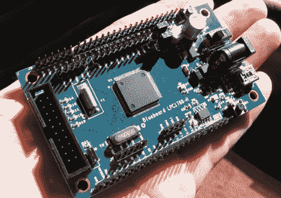

# ARM Cortex-M3 低成本原型开发

> 原文：<https://hackaday.com/2010/03/17/arm-cortex-m3-prototyping-on-a-budget/>

NGX Technologies [给我们送来了这个 Blueboard LPC1768-H](http://shop.ngxtechnologies.com/product_info.php?cPath=21&products_id=65) 来玩。它基本上是恩智浦 LPC1768 ARM cortex-M3 微控制器的分线板([数据表](http://www.google.com/url?sa=t&source=web&ct=res&cd=3&ved=0CA4QFjAC&url=http%3A%2F%2Fics.nxp.com%2Fproducts%2Flpc1000%2Fdatasheet%2Flpc1764.lpc1765.lpc1766.lpc1767.lpc1768.lpc1769.pdf&rct=j&q=lpc1768+datasheet&ei=mQKhS6SaCoOQNbKuhM4H&usg=AFQjCNHmVJ1ch4SRhFRinzS9qvtJJrzZ9w))。该板增加了一些额外的好东西，如迷你 USB 连接器或桶形插孔的选择，为芯片提供稳压电源。还有一个内部 RTC 的时钟晶体和一个 Atmel 256kb EEPROM 芯片。该芯片有 70 个 I/O 端口，可通过电路板顶部和底部的引脚接头访问。左边的 20 针接口是给 JTAG 程序员用的(是的，你需要[一个单独的程序员](http://www.frozeneskimo.com/electronics/arm-tutorials/jtag-wiggler-clone/))。售价仅为 32.78 美元，对于需要比一些传统的业余爱好控制器[更大功率的项目来说，这是一条非常容易实现的路线。自从 NGX 上一次上市以来，运费似乎已经下降，现在运送到美国不到 10 美元。](http://hackaday.com/2010/01/23/ideas-based-on-photo-frame-clock/)

LPC1768 与我们查看的的 [mbed 中的控制器相同。缺少的是一些接口硬件和引导加载程序，但代价是节省了 66 美元。这是将 AVR 板嵌入 Arduino，一种更接近硬件的方式。](http://hackaday.com/2009/11/21/review-mbed-nxp-lpc1768-microcontroller/)

我们认为缺少了一些东西。最值得注意的是，主板本身没有数据表或用户指南。唯一可用的信息是[一个原理图(PDF)](http://blueboard-lpc1768.googlecode.com/files/Blueboard_lpc1768_H_schematics.pdf) ，但对于那些已经精通微控制器工作的人来说应该足够了。板上还有一个 12MHz 的时钟晶体，但它似乎没有跳线，以防你想使用不同的频率。我们不确定这是否是一个大问题，内部 RC 振荡器提供了很大的灵活性，包括高达 100MHz 的操作。

我们认为这是一个坚实的平台，因为它的价格低廉，将有助于更多的人进入 ARM 开发。请在评论中告诉我们你的想法。