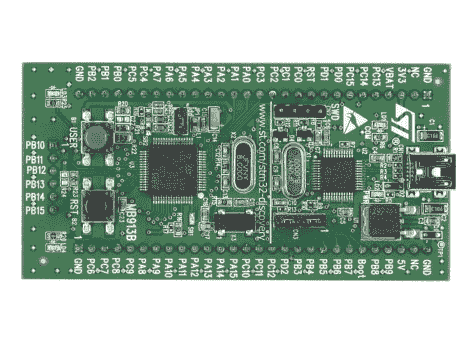

# 利用 STM32 Discovery 实现廉价的 ARM 原型开发

> 原文：<https://hackaday.com/2010/10/12/arm-prototyping-on-the-cheap-with-stm32-discovery/>

意法半导体推出了另一种廉价的开发板；STM32 Discovery 是一款 ARM Cortex-M3 原型开发平台。售价不到 10 美元，正好符合[的 8 位产品](http://hackaday.com/2009/11/23/stm8s-discovery-microcontrollers-reach-a-new-low/)，但这款是 32 位的，有 5 KB 的内存和 128 KB 的编程内存。它运行一个引导加载程序，并有板载 USB，便于编程。他们甚至有三个残缺的 IDE 来帮助你开始。

不幸的是，随着 Linux 支持的排除，这种趋势越来越明显。[Gordon]来信让我们知道有几种形式的希望(但不是使用 USB 功能)。第一个是[使用 RS232](http://gostm32.blogspot.com/2010/09/getting-voltages-right.html) 的串行程序员，这是【Paul】想出来的(他的博客上有更多内容，所以花点时间在那里)。但是你也可以[使用串行调试协议](http://blog.willdonnelly.net/2010/10/02/serial-wire-debugging-the-stm32-via-the-bus-pirate/)对电路板进行编程。

不管怎样，你仍然需要一个编译代码的方法。使用本指南，我们已经成功推出了自己的 [GNU ARM 交叉编译器。或者你可以通过下载](http://fun-tech.se/stm32/gcc/index.php) [Sourcery G++ lite](http://www.codesourcery.com/sgpp/lite/arm) 抓取一个预建的包。