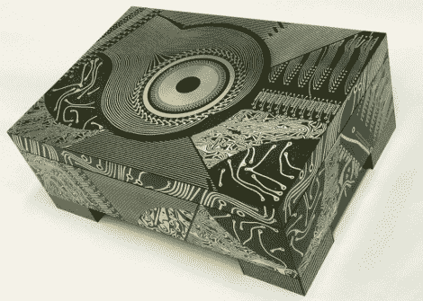

# 来自纸板艺术品的艺术作品

> 原文：<https://hackaday.com/2010/08/29/art-piece-from-board-artwork/>

[Theo Kamecke]是一位艺术家，他使用印刷电路板制作出引人注目的作品。我们以前见过[印刷电路板被用作人造彩色玻璃](http://hackaday.com/2010/06/13/hackaday-links-june-13-2010/)，但【西奥】的工艺与我们见过的任何东西都不同。他的网页上至少有一块是 1960 年的老式电路板的用法，但我们想知道他是否没有设计一些适合他工作的电路板。无论哪种方式，我们都希望看到他承担我们在 6 月份看到的那个[机械化扩展圆桌](http://hackaday.com/2010/06/07/furniture-bots-transform/)的收尾工作。在他的照片流上可以看到更多他的作品。

[ [照片来源](http://www.flickr.com/photos/theo_kamecke/3496825247/)

[谢谢莫丘斯]