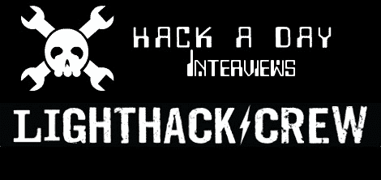

# 向获胜者提问更新第 5 天:答案

> 原文：<https://hackaday.com/2010/02/05/ask-a-winner-updates-day-5-answers/>

不久前[我们问我们的读者](http://hackaday.com/2010/01/09/ask-a-winner/)他们想从推送 N900 的赢家和他们的黑客那里听到什么。我们得到了一些愚蠢的问题，一些严重的，我们问了两个，现在推团队已经回答了。

一天过去了，[方走了](http://hackaday.com/2010/02/04/winners-of-the-n900-push-showcase-tickets/)，剩下的只有最后的面试。[轻黑客团队](http://blogs.nokia.com/pushn900/category/light-hack-crew/)给了我们一个比我们习惯的稍短的回应，但结果还是一样甜蜜。

>感谢您抽出时间回答 HackaDay 的一些问题。我们喜欢黑客愿意与我们分享他们的工作。

>你和你的团队是怎么走到一起的？有什么有趣的背景故事想分享吗？

LIGHTHACK CREW 是由三个来自澳大利亚珀斯的疯狂椰子组成的三人组。[戴夫]和[汤姆]是很久以前的朋友，[莎娜]是很久以前的朋友，

>你和你的团队合作过其他项目吗？蜂窝相关项目？N900 项目？

不，这是我们第一次在一起。

>你团队项目的主要灵感是什么？

聚焦灯光涂鸦项目是[汤姆]的主意，这让我想到[莎娜]是一位涂鸦模板艺术家。

>你认为当你完成/发布时，人们会有什么反应？

人们会喜欢它，因为它很有趣，创造轻涂鸦和容易做，所有你需要的是黑 N900 和电子 LED 可以。

>你对你的团队有什么未来的计划吗？继续 N900 开发？更新您当前的项目？

希望继续开发 Light Hack 软件，并将其应用到其他设备上

>你对其他获奖者有什么看法？

作为一名滑冰运动员，主要是长板，我对焊接滑冰队感兴趣，其他人也很棒，

>我们评论员的提问。

>你对 Arduino 有什么想法？您打算在您的项目中使用它吗？

[Tom]是电子天才，但我要说他发现 Arduino 非常简单。

>N900 的硬件和软件使用情况如何？

伟大的从小我已经看了和使用，手机是非常强大的，它不是运行一个 snapdragon，但该死的可以多任务！开源的 Maemo 操作系统非常酷，它是 linux 的事实使它更容易开发，因为已经为它设置了很多东西——SDK 安装的虚拟机映像是一条出路。

>你如何看待手机转向开源软件，比如 Maemo？你打算或者曾经尝试过 Android 吗？

我认为这很棒，我试过 iphone，但目标 C 和 100 美元对我来说都是新的！，还没来得及安卓。但是想去看看。

>(如果您使用辅助电源，例如运行电机)您的项目预计电池续航时间是多少？

我们目前使用 4 节 AA 或 4 节 AAA 电池。我肯定我们可以连接任何种类的电池。电池寿命不算太差，因为蓝牙真的只在按钮被按下时使用，LED 灯也很有效。

>我们能得到一份你在项目中使用的物品清单吗？(示例–蓝牙设备、电机、专用传感器等)

硬件:蓝牙模块，PIC 微控制器

软件:我使用了 C 语言，GStreamer 框架来捕捉视频，以及一些基本的图像处理算法:减法和移动平均滤波器来去除噪声。

>是的，我们实际上有一个读者(乔)问了下面的问题(随意省略)

>你多久换一次内裤？内衣？

38 度，我只是穿着我的木板

再次感谢！