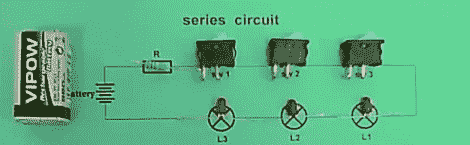

# 问 Hackaday:巨魔物理版

> 原文：<https://hackaday.com/2011/12/19/ask-hackaday-troll-physics-edition/>

[马丁]发来了他在地铁里发现的两个视频。[第一个视频](http://www.youtube.com/watch?NR=1&feature=endscreen&v=RkTvDjhImwo)是一个简单的电路，有一个电阻、三个开关和三个 led。所有部件都在摄像机前焊接在一起。当连接电池时，打开第一个开关使第一个 LED 点亮。打开第二个开关使第二个 LED 亮起，同样的事情也适用于第三个开关和 LED。显然，我们面对的是几杯咖啡都无法理解的力量。

第二个视频采用了相同的电阻/开关/发光二极管，这次是并联电路。接通第一开关使第一 LED 点亮，第二开关使第二 LED 点亮。我们真的在和巨魔物理学专家打交道。

这可能真的是良性和无趣的事情，但它肯定足以在周一早上唤醒足够多的脑细胞。我们不打算假设，所以看看我们认为正确答案在哪里的评论。

[https://www.youtube.com/embed/RkTvDjhImwo?version=3&rel=1&showsearch=0&showinfo=1&iv_load_policy=1&fs=1&hl=en-US&autohide=2&wmode=transparent](https://www.youtube.com/embed/RkTvDjhImwo?version=3&rel=1&showsearch=0&showinfo=1&iv_load_policy=1&fs=1&hl=en-US&autohide=2&wmode=transparent)
[https://www.youtube.com/embed/OoPCDiMF108?version=3&rel=1&showsearch=0&showinfo=1&iv_load_policy=1&fs=1&hl=en-US&autohide=2&wmode=transparent](https://www.youtube.com/embed/OoPCDiMF108?version=3&rel=1&showsearch=0&showinfo=1&iv_load_policy=1&fs=1&hl=en-US&autohide=2&wmode=transparent)