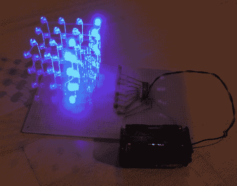

# ATtiny Hacks: ATtiny 控制的 4x4x4 LED 立方体具有独特的设计

> 原文：<https://hackaday.com/2011/09/21/attiny-hacks-attiny-controlled-4x4x4-led-cube-has-a-unique-design/>

[Tom]最近开始用 Charlieplexing 做实验，并写信分享了他用 ATtiny24 做的 4x4x4 立方体。与[类似，我们前几天展示的这个极简的 4x4x4 LED 立方体](http://hackaday.com/2011/09/18/attiny-hacks-2313-driving-a-4x4x4-led-cube)，【汤姆的】版本试图使用尽可能少的引脚来驱动 LED，但方式不同。

[Tom]不想牺牲亮度，所以他决定 led 的占空比为 1/8。问题是 ATtiny 的 I/O 端口无法支持这种电流，因此他需要一种不同的方法来驱动 led。他没有使用任何类型的移位寄存器来控制 led，而是像在以前的项目中一样，选择只使用晶体管。

为了让他的 Charlieplexed cube 总共使用 9 个 I/O 引脚，他必须在设计上有所创新。他将该结构的每一层分成两组互不相连的发光二极管，利用对角线互连将所有东西正确连接起来。

正如你在下面的视频中看到的，它似乎工作得很好。虽然它比我们最近推出的另一款魔方多使用了两条 I/O 线，但我们喜欢这种简单的无移位寄存器设计。

[https://www.youtube.com/embed/JUH2AruYhhw?version=3&rel=1&showsearch=0&showinfo=1&iv_load_policy=1&fs=1&hl=en-US&autohide=2&wmode=transparent](https://www.youtube.com/embed/JUH2AruYhhw?version=3&rel=1&showsearch=0&showinfo=1&iv_load_policy=1&fs=1&hl=en-US&autohide=2&wmode=transparent)