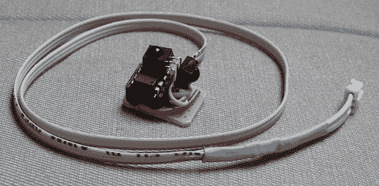

# ATtiny Hacks:红外制导和导航

> 原文：<https://hackaday.com/2011/09/23/attiny-hacks-infrared-guidance-and-navigation/>

在[trandi]得到一架便宜的遥控直升机后，他意识到实际驾驶遥控直升机的困难。他没有放弃，而是决定[对红外协议](http://trandi.wordpress.com/2009/09/20/arduino-processing-helicopter-ir-remote/)进行逆向工程，然后围绕 ATtiny 构建一个解码器，该解码器将使用串行连接向另一个微控制器发送命令。

遥控器的通信协议在 Freeduino 和在 Arduino 网站上找到的 IR 远程分析草图【trandi】的帮助下被解码。将数据导入 Gnuplot 后，有足够的数据来编写草图，以可视化红外脉冲。

在弄清楚他的遥控器的协议后，[trandi] [建造了一个微型电路](http://trandi.wordpress.com/2010/06/19/ir-remote-syma-s026-dedicated-board-v2/)来解密红外命令，并通过串行链路将它们发送到另一个微控制器。基于 ATtiny45 的构建不会占用 perfboard 太多空间，因此可以非常容易地安装在他选择的任何机器人上。他最后[把它连接到一个乐高 NTX 积木](http://trandi.wordpress.com/2010/10/29/nxt-arduino-i2c-ir/)上，这样他就可以用直升机遥控任何他能想到的乐高积木。

[trandi]围绕一个廉价的遥控器投入了大量的工作；如果遥控器坏了，一切都将化为乌有。这是由一个[红外信标](http://trandi.wordpress.com/2010/02/15/ir-beacon/)解决的，它复制了遥控器的功能。这种信标以 ATtiny13 为基础，可以作为自主机器人的独立信标，也可以接受计算机的串行命令。如果你问我们的话，这是个不错的建筑。