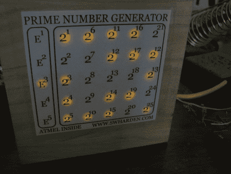

# ATtiny2313 质数发生器

> 原文：<https://hackaday.com/2010/08/24/attiny2313-prime-number-generator/>

【斯科特·哈登】[质数发生器](http://www.swharden.com/blog/2009-06-10-primary-prototype-complete/)展示了一种使用 LED 矩阵呈现可读信息的绝佳方式。该项目位于一个铰接的木箱中，箱盖上有一个网格状的孔，用于 led。[Scott]用打印输出覆盖了矩阵，显示了代表不同素数的 2 的幂。在里面你会发现一个 ATtiny2313 微控制器处理列扫描和素数测试。我们已经嵌入了一个视频，其中[斯科特]非常详细地解释了这个项目，但你也应该看看他的[原型](http://www.swharden.com/blog/2009-06-04-prime-prototype-construction/)和[建设](http://www.swharden.com/blog/2009-06-07-mcppng-nearing-completion/)页面。

[https://www.youtube.com/embed/k4Req0I7lbY?version=3&rel=1&showsearch=0&showinfo=1&iv_load_policy=1&fs=1&hl=en-US&autohide=2&wmode=transparent](https://www.youtube.com/embed/k4Req0I7lbY?version=3&rel=1&showsearch=0&showinfo=1&iv_load_policy=1&fs=1&hl=en-US&autohide=2&wmode=transparent)