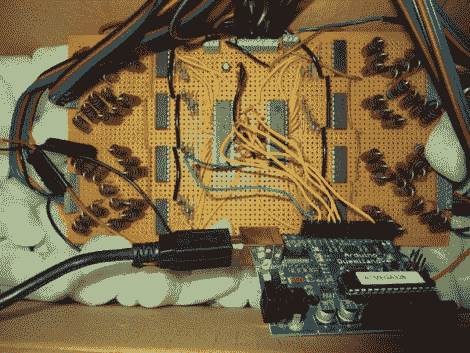

# 音频控制派对灯

> 原文：<https://hackaday.com/2010/11/28/audio-controlled-party-lights/>

[Thibault Brevet]希望他自己的派对灯光随着音乐而跳动和减弱。[他最终构建了一个基于 Arduino 和运行处理的 PC 的系统](http://www.welcomeonboard.ch/sideprojects/led/)。混合板的输出被输入 PC，并由处理脚本进行测量。从那里，计算出的光线水平被发送到 Arduino，通过上面看到的控制板寻址 led。[Thibault]制造了四个 LED 模块，每个模块有两个相隔几英尺的 4 通道 LED(红色、绿色、蓝色、白色)。这意味着需要 32 个 PWM 信号来驱动系统。为此，他使用了一对 TLC5940 16 通道 PWM 芯片，其功能类似于级联移位寄存器，但具有一些奇妙的电流限制和点校正功能。休息后看看演示，看看他完成了什么。

TLC5940 是驱动 RGB LED 的[热门选择，如果你决定让自己](http://hackaday.com/2010/09/30/dazzling-coat-sure-to-be-in-demand-with-pimps-everywhere/)[成为乒乓 LED 墙](http://hackaday.com/2010/11/21/led-wall-and-kinect-join-forces/)，它将是一个不错的选择。

[https://player.vimeo.com/video/17200281](https://player.vimeo.com/video/17200281)