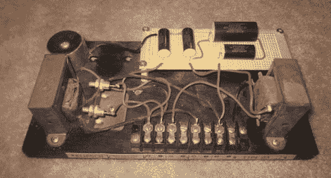

# 音频交叉恢复服务

> 原文：<https://hackaday.com/2011/01/17/audio-crossover-back-in-service/>

音频分频器是任何高端扬声器系统的必备工具。因为大多数单个扬声器无法像多个驱动器那样覆盖可听声音的整个频谱，所以有必要将输入信号分成低频和高频部分。当[安东尼]的一个朋友准备将一辆经典的 [Klipsch AA 跨界车](http://www.networkanthony.com/index.php/2011/01/klipsch-type-aa-crossover-rebuild/)送去专业维修时，[安东尼]坚持说可以省点钱自己动手。

交叉的油罐电容器已经坏了，所以订购了一套新的金属化聚丙烯电容器来承担这项任务。在小心地移除旧的盖子后，[Anthony]在试验板上组装了新的一套，并将板安装到旧的[交叉](http://en.wikipedia.org/wiki/Audio_crossover)底座上(连同一些有品味的麦当劳吸管垫片)。整个过程在他的博客上有详细描述，我们相信他的朋友通过这种家庭维修方法节省了很多钱。电容器问题是维修新旧电子产品时常见的[问题](http://hackaday.com/2009/02/18/lcd-repair/)，当设备开始出现问题时，这总是一个很好的着手点。