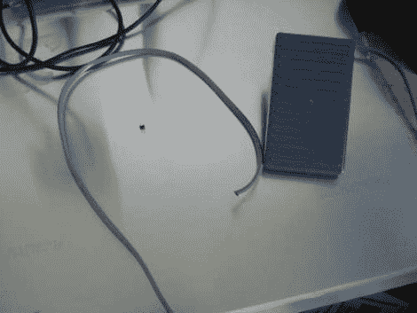

# 用脚踏板自动执行重复的电脑操作

> 原文：<https://hackaday.com/2011/05/05/automate-repetitive-pc-actions-with-a-foot-pedal/>

Instructables 用户[bkovac]厌倦了每当他想启动终端窗口时就点击桌面上的终端图标。除了键盘快捷键，他认为消除这一过程的单调最简单的方法是用脚踏板启动终端窗口。

他抓起一个放在工作室里的踏板，把它拆开，以确保开关触点的配置适合他的特殊用途。电线连接到 Arduino，Arduino 使用 Python 脚本通过串行与计算机对话。

虽然这种设置运行良好，但它绝对不是完成工作的最有效或最简单的方式。事实上，[我们已经看到了更简单的其他方法](http://www.youtube.com/watch?v=a3NxQ60E72k)，尽管它们缺乏这种特殊修改的潜在通用性。

而不是简单地在他的电脑上加载一个终端窗口，我们希望看到这个踏板得到增强，以执行多种功能——在这一点上，Arduino 将是一个相当不错的选择。我们可能会先把全尺寸的 Arduino 换成一个小的，安装在踏板里面。基于在给定时间段内发生的按压次数，可以使用多次脚按压来触发不同的事件。通过使用它来触发基于手势的事件，它可以变得更加有用，类似于 Chrome 和 Firefox 的插件。

你会如何增强(bkovac 的)踏板界面？请在评论中告诉我们。