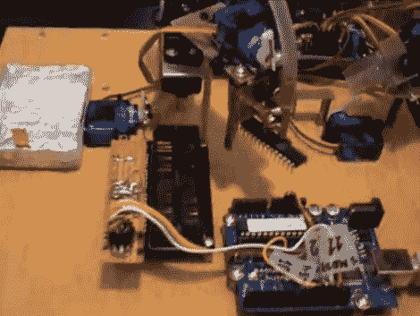

# 自动化芯片刻录

> 原文：<https://hackaday.com/2010/10/07/automated-chip-burning/>

[Alexsoulis]需要将 Arduino 引导加载程序刻录到大量 ATmega328 芯片上。他没有坐在那里一次一个地将芯片插入编程器，而是建造了一个机器人微控制器编程器。

它从管中的 DIP 封装微控制器开始，用伺服电机一个接一个地分配它们。一只手臂摆动过来，用鱼泵驱动的真空镊子夹起芯片，类似于我们最近看到的[取放头](http://hackaday.com/2010/10/01/open-source-pick-and-place/)。从那里，芯片被放入 ZIF 插座，由 Arduino 编程。一旦该过程完成，它被移动到侧面，并且该过程重复。

我们已经报道过[使用 Arduino 作为 AVR 程序员](http://hackaday.com/2009/07/15/avr-isp-programming-via-arduino/)，但是我们自己从来没有实际做过(我们使用 AVR Dragon 程序员)。休息后看看视频，如果你认为实际的编程似乎慢得令人难以置信，请告诉我们。

[https://www.youtube.com/embed/MPusu0SkN2w?version=3&rel=1&showsearch=0&showinfo=1&iv_load_policy=1&fs=1&hl=en-US&autohide=2&wmode=transparent](https://www.youtube.com/embed/MPusu0SkN2w?version=3&rel=1&showsearch=0&showinfo=1&iv_load_policy=1&fs=1&hl=en-US&autohide=2&wmode=transparent)

[感谢凯尔通过[让我们制造机器人](http://letsmakerobots.com/node/22393)