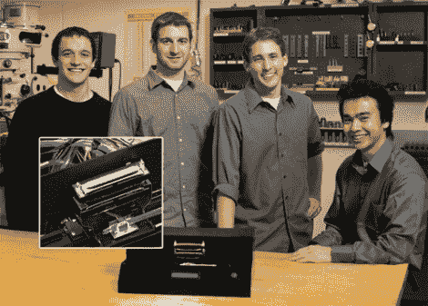

# 自动口琴演奏简单的曲子

> 原文：<https://hackaday.com/2011/03/15/automated-harmonica-plays-simple-tunes/>

似乎现在几乎所有的东西都是自动化的。放眼望去，人们正被从流程中剔除，以提高效率，减少出错几率。[Jon]然而，我看到了一个自动化尚未显著触及的过程——[吹口琴](http://www.designnews.com/article/517345-Gadget_Freak_Case_182_Automation_Comes_to_the_Harmonica.php)。

他建造了一台口琴演奏机，只需按几下按钮就能演奏一些简单的歌曲。这台机器由三个 PIC 控制器、一台空气压缩机和一对口琴组成。主 PIC 控制器管理整个操作，从 PIC 驱动 LCD 获取输入，然后将演奏指令传递给管理口琴的 PIC。

一旦机器启动并选择了一首歌曲，机器就会播放，并在播放完毕后提示播放一首新歌。然而，这台机器并不像人类那样吹口琴。一只口琴的簧片是反过来的，所以演奏者只需要吹气，而不需要真空来提供通常在口琴演奏中使用的吸气动作。

正如你在这个视频中看到的[，这个装置工作得很好，尽管它可能需要更多的工作来达到“人类”的感觉。](http://www.designnews.com/video/Gadget_Freak/4625-GF182_Automated_Harmonica.php)

[谢谢，本]