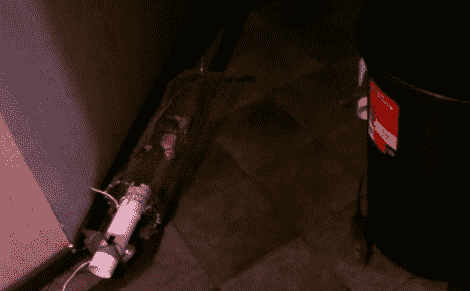

# 自动化人性化害虫控制

> 原文：<https://hackaday.com/2011/09/24/automated-humane-pest-control/>

[托比]似乎有一点老鼠的问题。

虽然大多数人会倾向于简单地购买超大的 Victor 弹簧捕鼠器，然后就此收工，[Tobie]更人性化一点。为了帮助解决他的问题，同时也确保在这个过程中没有老鼠受到伤害，他建造了捕鼠器 2000。

自我描述为完全超越顶部，捕鼠器 2000 用苹果和玉米引诱啮齿动物进入其遏制区，使用伺服驱动的陷阱门将它们固定在里面。门是由 Arduino 触发的，Arduino 使用红外传感器监控保持笔的移动。所有的动作都被他的 Eee-PC 上的网络摄像头拍摄下来，正如你在下面的短片中所看到的。

这当然不是控制害虫问题的最具成本效益的方法，但是如果你有一些备用零件，为什么不呢？这比我们见过的其他一些控制啮齿动物的方法要人道得多，而且肯定比和老鼠住在一起要好！

[https://www.youtube.com/embed/DUb7yXxJKOY?version=3&rel=1&showsearch=0&showinfo=1&iv_load_policy=1&fs=1&hl=en-US&autohide=2&wmode=transparent](https://www.youtube.com/embed/DUb7yXxJKOY?version=3&rel=1&showsearch=0&showinfo=1&iv_load_policy=1&fs=1&hl=en-US&autohide=2&wmode=transparent)