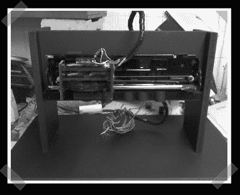

# 自动颜色检测

> 原文：<https://hackaday.com/2007/05/08/automatic-color-detection/>

【KLOZ】提交了他大学时期的[期末项目](http://kloz.tripf.net/ldr/)。他没有使用昂贵的 CCD 相机，而是使用一组彩色~~电阻~~led 和光敏电阻(我假设他指的是光敏电阻)来确定产品的颜色(m & ms)。他使用一台旧惠普喷墨打印机的托架，一个定制的 cnc 切割轮来分离和交付 m & ms，以及一个视差推进器微控制器板来将所有这些连接在一起。现在他可以独占所有绿色的了。

更新:对，我是傻逼。我指的是彩色发光二极管。抓到我的人会收到一封邮件——我有东西给你。

休息之后，请观看分类演示视频

*   [永久链接](http://kloz.tripf.net/ldr/)