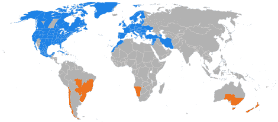

# 时钟项目的自动夏令时补偿

> 原文：<https://hackaday.com/2012/07/16/automatic-daylight-savings-time-compensation-for-your-clock-projects/>

在开发我的乒乓时钟的很早时候，我就有了自动补偿 T2 夏令时的想法。这是一个有趣的特性，但它是一个奢侈品，所以我想我可以把它作为未来的改进。现在是时候了，我将汇报我所学到的东西，以及如何将这些东西添加到你自己的项目中。

在添加这个特性之前，有两件事需要考虑。这值得努力吗？这是否会让时钟更加混乱而不是更容易使用？

至于后者，如果你 ***是*** 负责初始设置时间，而你 ***不是*** 负责在我们后退或跃进时重置时钟，会不会造成混乱？也许最初是这样，但是我在项目中使用的电池供电的 RTC 应该意味着你设置一次就再也不用重置它了。一个例外是夏令时，这就是我要补偿的。

到底值不值得，很难在事后回答。你应该考虑到 DST 规则并不是一成不变的，它们会随时改变。此外，并非世界上所有地方都遵守这一习俗。这意味着您不仅需要实现补偿，还应该添加一个打开和关闭补偿的方法，以及更改观察补偿的规则。

休息后加入我，学习我用来每年两次自动调整时间的方法和代码。

**实施**

实现 DST 补偿有两个部分。第一部分是弄清楚我们现在是在遵守夏令时还是标准时间生效了。问题的第二部分是开发一种方法，在不干扰时钟运行或设置的情况下进行补偿。

这篇文章将只解决第一个问题；如何决定夏令时何时生效？我计划在第二篇文章中详述使用这些信息的必要机制。

**问题**



Image source: [Wikimedia Commons](http://en.wikipedia.org/wiki/File:DST_Countries_Map.png)

夏令时并不从某一固定日期开始，例如每年的 4 月 15 日。相反，它从一周中的某一天开始。美国目前在四月的第二个星期日凌晨 2:00 开始实行 DST。这一问题因这一法定规则不时发生变化而变得更加复杂，最近一次是在 2007 年美国的规则发生了变化。为了进行补偿，我们必须能够回答这个问题:DST 开始的确切日期是什么时候？

我们需要一种算法，它采用基于星期几(DOW)的规则，并将它们转换成精确的日期答案。算法仍然工作所需的最小输入信息量是多少？让我们找出答案。

**算出来**

如果你想知道夏令时开始的日期，你会怎么做？假设夏令时从四月的第二个星期天开始，那么它从去年(2011 年)的哪一天开始呢？很自然，你会看着 2011 年 4 月的日历，数着星期二，直到第二个星期二。这正是我们的算法要做的，除了它前面不需要有日历。为了解决我们的问题，让我们明确说明我们想要使用的方法:

*   找出给定月份的第一天是星期几。
*   递增日期，直到到达目标星期几。
*   增加周数，直到你达到目标日期。

我们从查看日历中得到的一条有用的信息是这个月是从星期几开始的。幸运的是，这很容易计算，只需在谷歌上快速搜索一下。

**计算任意日期的星期几**

维基百科有一篇关于计算星期几的非常好的文章。在这个计算中花费的大部分时间用于[确定这一年是否是闰年](http://en.wikipedia.org/wiki/Leap_year#Algorithm)。剩下的计算包括查找表以得到最终答案。幸运的是，道琼斯计算是一个常见的问题，因此有几个简化的算法可用于这项任务。我选择使用[坂本的算法](http://en.wikipedia.org/wiki/Calculating_the_day_of_the_week#Sakamoto.27s_algorithm)，因为它已经用 C 写好了，而且相当简单。

```
int dow(int y, int m, int d)
   {
       static int t[] = {0, 3, 2, 5, 0, 3, 5, 1, 4, 6, 2, 4};
       y -= m &lt; 3;
       return (y + y/4 - y/100 + y/400 + t[m-1] + d) % 7;
   }
```

确切地解释这是如何工作的，这是一个你可以未雨绸缪的练习。当试图解决这个问题时，确保你查阅了优先规则。注意“m < 3”将首先被求值，如果为假则返回 0，如果为真则返回 1。我们还想指出，第三行代码中的三个除法运算用于调整闰年。

**找到正确的开始日期**

现在我们知道了一月一日是星期几，我们需要找到目标日第一次出现的日期。如果我们将目标日期分配给变量“DOW ”,将每月第一天的星期几分配给“firstDOW ”,则很容易使用循环递增，直到我们达到目标:

```
char targetDate = 1;
  while (firstDOW != DOW){
    firstDOW = (firstDOW+1)%7;
    targetDate++;
  }
```

当变量“targetDate”匹配我们的目标日期的第一次出现时，这个代码循环将退出。但这只是解决了一部分问题。我们还需要确定该月中第二次、第三次或其他日期。

**调整目标日期以考虑周数**

如果我们要寻找给定月份的第二个星期天，我们可以将数字 2 赋给变量“NthWeek”:

```
  targetDate += (NthWeek-1)*7;
```

这个简短的代码片段将在我们的目标日期第一次出现后为每周的日期增加 7。因为我在乘以 7(一周中的天数)之前减去 1，所以如果我们要寻找一个月中的第一个星期天，就不会添加任何内容。

**将所有这些放在一起**

如果我们把所有的代码打包成一个漂亮的小包，我们最终会得到一个基于输入信息返回日期的函数。为了将注意力集中在这个问题上，我首先定义了将传递到函数中的信息，以及我计划从中获取的信息:

*   输入:年、月、星期几(例如:星期日= 0)、月的第 n 周(例如:月的第二个星期日= 2)
*   输出:表示日期的整数(例如:15 是一个月的第 15 天)

因为我们的第一步依赖于另一个算法，所以它需要包含在我们的包中。我对它做了一点小小的改动，尽可能地用 char 替换了许多 int 数据类型。根据你使用的编译器，这可能最终会节省内存。

```
#include &lt;stdio.h&gt;
char buff[50];

int myYear = 2011;
char myMonth = 04;
char myDOW = 0;
char myNthWeek = 2;

/*--------------------------------------------------------------------------
  FUNC: 6/11/11 - Returns day of week for any given date
  PARAMS: year, month, date
  RETURNS: day of week (0-7 is Sun-Sat)
  NOTES: Sakamoto's Algorithm
    http://en.wikipedia.org/wiki/Calculating_the_day_of_the_week#Sakamoto.27s_algorithm
    Altered to use char when possible to save microcontroller ram
--------------------------------------------------------------------------*/
char dow(int y, char m, char d)
   {
       static char t[] = {0, 3, 2, 5, 0, 3, 5, 1, 4, 6, 2, 4};
       y -= m &lt; 3;
       return (y + y/4 - y/100 + y/400 + t[m-1] + d) % 7;
   }

/*--------------------------------------------------------------------------
  FUNC: 6/11/11 - Returns the date for Nth day of month. For instance,
    it will return the numeric date for the 2nd Sunday of April
  PARAMS: year, month, day of week, Nth occurence of that day in that month
  RETURNS: date
  NOTES: There is no error checking for invalid inputs.
--------------------------------------------------------------------------*/
char NthDate(int year, char month, char DOW, char NthWeek){
  char targetDate = 1;
  char firstDOW = dow(year,month,targetDate);
  while (firstDOW != DOW){
    firstDOW = (firstDOW+1)%7;
    targetDate++;
  }
  //Adjust for weeks
  targetDate += (NthWeek-1)*7;
  return targetDate;
}

int main(void){
  //Used to test on a computer
  sprintf(buff,&quot;%i&quot;,NthDate(myYear,myMonth,myDOW,myNthWeek));
  printf(&quot;%s\n&quot;,buff);
}
```

我写这篇文章的目的是为了在微控制器上使用它，但只是为了测试，我在计算机上包含了一些 I/O 反馈。您可以删除前两行和整个 main 函数，并将其放入您的项目中。在 Linux 机器上，使用“gcc -o dst dst.c”用 GCC 编译它，然后使用“GCC-o dst . c”运行它。/dst "。

**结论**

这是相当少量的代码，不需要大量的处理能力。如果您可以将设置当前日期的选项添加到时钟项目中，这很容易融入代码中。你需要解决的一件事是如何设置和存储时间。这将根据夏令时是否有效而有所不同。

作为旁注。我最终在[项目欧拉](http://projecteuler.net/)问题中重用了这段代码。我想这项工作已经有回报了。

**资源**

[示例代码](https://github.com/szczys/Automatic-Daylight-Savings-Time/blob/d13e7e66fbbd45d9dd5eb62b820cecce6d949547/dst.c)