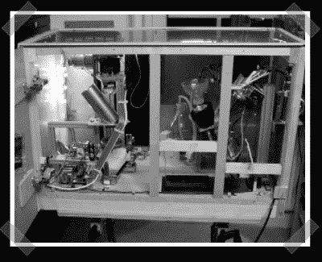

# 自动法式压榨咖啡冲泡机

> 原文：<https://hackaday.com/2007/07/18/automatic-french-press-coffee-brewer/>

【克里斯托夫】送来了【手指】相当有趣的咖啡黑客[项目](http://www.fingers-welt.de/gallerie/eigen/maschine/kaffee2/kaffee2.htm)。(用鱼来[翻译成英文](http://babelfish.altavista.com/babelfish/tr)。)利用各种偷来的零件，他建造了自己的自动化法式啤酒酿造机。一台好的法国印刷机有点像一门艺术，所以我能理解自动化的渴望。研磨本身并不太重要，但冲泡时间会随着咖啡豆的烘焙和研磨而变化。就我个人而言，我发现合适的酿造温度是一台好印刷机的真正关键。[手指]机器提供了一种始终如一的方式，但定制的铝制冲泡室可能会影响冲泡温度。

*   [永久链接](http://www.fingers-welt.de/gallerie/eigen/maschine/kaffee2/kaffee2.htm)