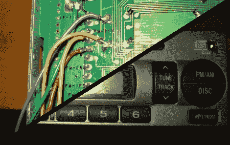

# Aux-in 黑了一台 04 年的斯巴鲁收音机

> 原文：<https://hackaday.com/2011/05/18/aux-in-hacking-an-04-subaru-radio/>

[乔丹]写信给我们展示他被改装的汽车音响。[乔丹]的 2004 年斯巴鲁，像我们的许多汽车一样，不提供任何类型的辅助输入，并且 aux-in/mp3 适配器往往运行在不那么便宜的价格范围内。即使是替换的头部单元对他的血液来说也太丰富了。所以是时候把一些东西连接到旧的主机上了。

在检查收音机的印刷电路板时，乔丹设法找到了将音频从调频接收器传送到立体声放大器的线路。我们见过的大多数辅助输入攻击都涉及到[欺骗立体声](http://hackaday.com/2010/08/12/adding-an-input-to-an-old-head-unit/)以为插入了一些媒体，即使与 PCB 上的[音频线](http://hackaday.com/2010/08/15/more-car-audio-input-hacking/)接口。这些要求改变磁带/CD 的功能，也许是永久性的。更糟糕的是，你可能不得不在一张空白的 CDR 上走来走去，上面有一大堆曲目！所有这些都是为了欺骗立体声系统，使其能够输出音频。

相反,[Jordan]瞄准了来自 FM 立体声的音频线路，因为收音机总是在激活时被启用。一旦音频迹线被定位，它们就被切断并用 1/8”立体声插头绕过。此设置允许 FM 音频信号在断开连接时通过连接器，并在 mp3 播放器断开连接时切断任何无线电音频。我们已经看到同样的方法被用在一个老式立体声系统上。干得好！