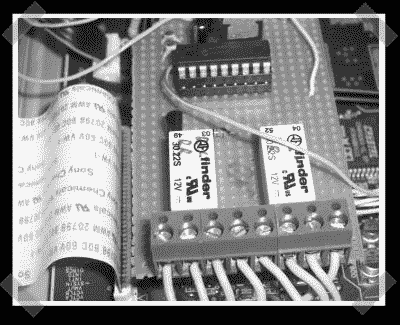

# 辅助立体声接收器控制

> 原文：<https://hackaday.com/2007/05/18/aux-stereo-receiver-controls/>

【Bob van loose】在他的 Onkyo 接收器上增加了一个由 PIC 16F84A 制成的[远程学习电路](http://www.xs4all.nl/~loosen/speaker_switch/)——恰好有远程按钮和一个用于外部设备的 ttl 控制链接。PIC 监听接收器上的远程链接。通过将引脚接地，它将学习下一个收到的远程命令。在这种情况下，当他在电视和计算机之间切换时，他使用它来交换左/右前/后信号，以获得正确的扬声器方向。如果你把它和烟雾发生器结合起来，这将是一个有趣的外部加密狗…

*   [永久链接](http://www.xs4all.nl/~loosen/speaker_switch/)