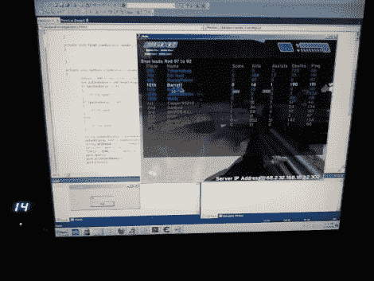

# 辅助记分板直接从内存中读取状态

> 原文：<https://hackaday.com/2010/09/13/auxiliary-scoreboard-reads-status-directly-from-memory/>

[StaticChanger] [建造了一个记分牌](http://staticchanger.com/?p=9)来显示他在《光晕》中的杀戮统计数据。是的，[我们在](http://hackaday.com/2009/12/30/tf2-kill-counter-binary-style/)之前已经见过杀戮计数器，但是我们喜欢他收集数据的方式。这个项目是[直接从内存中的一个地址](http://staticchanger.com/?p=22)读取乐谱。

使用一个叫做[作弊引擎](http://www.cheatengine.org/)的程序，可以嗅到一个程序使用的内存。几遍之后，程序会帮你找到你想要的数据的静态内存地址。一旦你有了它，你只需要在你想要的编程语言中使用一个指向那个地址的指针。在这种情况下，C#程序轮询该值，并指示 Arduino 在几个 7 段显示器上显示该值。瞧，这个数字出现在你的屏幕旁边，就像你在上图中看到的那样。