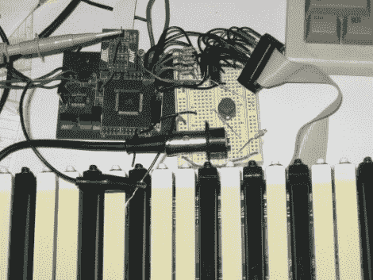

# AVR 外部存储器接口(XMEM)读取输入矩阵

> 原文：<https://hackaday.com/2011/12/06/avr-external-memory-interface-xmem-reads-input-matrix/>

从大量的输入中读取，就像这个钢琴键盘，可能会很乏味。即使在多路复用时，也有很多东西需要跟踪。但如果你选择了正确的微控制器，你可能有硬件辅助。这里有一个 ATmega640 is [使用它的外部存储器接口来读取密钥矩阵](http://www.openmusiclabs.com/learning/digital/input-matrix-scanning/xmem/)。

你可能还记得 Open Music Labs 的一篇文章，这篇文章讲述了只使用微控制器的一个引脚从移位寄存器中读取数据。这一次仍然使用移位寄存器，但不是引入一长串并行输入，而是对开关进行多路复用，以减少用于读取它们的 I/O 引脚数量。

74HC573 用于促进多路复用。我们不会深入探讨这部分是如何完成的；有一个单独的[帖子解释了](http://www.openmusiclabs.com/learning/digital/input-matrix-scanning/latch-mux/)这个过程。这里的独特之处在于 AVR 微控制器的 XMEM 外设用于获取数据。这是为外部存储芯片设计的，但如果你掌握好时机，它可以大大简化多达 128 个输入矩阵的读取。