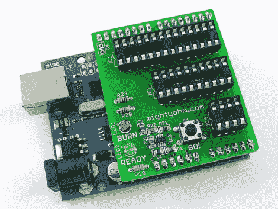

# AVR 高压救援屏蔽 2

> 原文：<https://hackaday.com/2010/12/14/avr-hv-rescue-shield-2/>

[杰夫·基泽]有了新版本的高压救生盾。该工具允许您使用 Arduino 来复位 AVR 微控制器上的熔丝位。如果您犯了一个错误，禁用了 reset 引脚，或者选择了不正确的时钟设置(这可能会发生在您身上)，这是必要的。为了让芯片起死回生，你需要使用高压编程。shield 的上一版本仅适用于高压并行编程(HVPP ),但这一版本也可以对没有足够并行通信输入的 8 引脚芯片使用高压串行编程(HVSP)。

正如我们在[我们的 AVR 编程教程](http://hackaday.com/2010/10/23/avr-programming-introduction/)中所谈到的，这不能替代 STK500 或 AVR Dragon 这样的高端程序员，但如果你已经有了一个 Arduino，一个工具包只需要 20 美元(或者你可以自己蚀刻和构建)。我们希望看到一个用于场外使用的 HVP 信号的突破头。没有分接头并不排除这一点，但由于您需要用于 12V 信号的板载升压转换器，并且由于引脚间距的原因，这种屏蔽不能用于试验板，因此很难接入非 DIP 使用的信号。我们还认为一些聪明的固件黑客，这可以用于高压编程，就像我们需要的那个 [LED 灯泡](http://hackaday.com/2010/12/09/part-2-help-me-reverse-engineer-an-led-light-bulb/)。