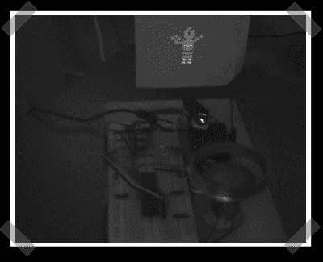

# AVR 激光投影仪

> 原文：<https://hackaday.com/2007/01/04/avr-laser-projector/>

我见过几个简单的 DIY 激光投影仪，就是振荡光束。[这个](http://heim.ifi.uio.no/haakoh/avr/)(滚过乒乓游戏)有 16 行分辨率。16 面镜子由一个电机旋转，AVR 控制器向激光发出脉冲来绘制图像。Via [Asish 的编程日志](http://ashishrd.blogspot.com/)(值得一提的是，他已经做了几个网络摄像头激光笔项目。)

*   [永久链接](http://heim.ifi.uio.no/haakoh/avr/)