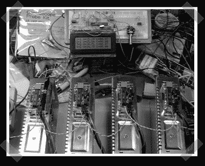

# AVR 改进型电动汽车充电器

> 原文：<https://hackaday.com/2007/04/30/avr-modified-ev-charger/>

【加里】的建了一些[好看的](http://www.knology.net/~gdion/index.html) AVR 项目。最有趣的是他为自己的 [EV 保时捷](http://www.knology.net/~gdion/EVPorsche/index.html)打造的充电[控制器/监控器](http://www.knology.net/~gdion/EVPorsche/chargers.html)。每个板控制一个充电器-每个电池一个充电器。当系统不为电池充电时，它会向 1978 年保时捷 924 仪表盘上的 VFD 显示屏提供实时数据。希望他会注意到流量的激增，并更新充电器项目[页面](http://www.knology.net/~gdion/charger.html)。

*   [永久链接](http://www.knology.net/~gdion/EVPorsche/chargers.html)