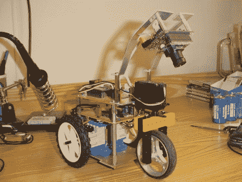

# 用于小型机器人机器视觉的 AVRcam

> 原文：<https://hackaday.com/2011/06/10/avrcam-for-small-robot-machine-vision/>

如果 2004 年的一个项目做得非常好，它仍然是相关的，这真是太棒了。 [AVRcam](http://www.jrobot.net/Projects/AVRcam.html) 就是这种情况。它使用 Atmel AVR mega8，可以做一些令人印象深刻的事情，比如以 30fps 的速度跟踪多达 8 个物体。硬件和软件也是开源的，所以应该可以自己构建一个。互联网上有许多像 it T3 这样的项目，尽管它们通常需要更强大的硬件。虽然，现在你可以在一个火柴盒里放一台电脑，所以我们看到越来越多的项目只是在机器人身上扔一个完整的 USB 摄像头来做简单的事情，比如跟随的[线。有争议的是哪种解决方案更优雅，但也许不是哪种更令人印象深刻。](http://www.jrobot.net/Projects/EyeBo.html)