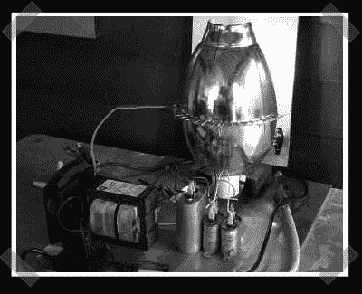

# 镇流器…超频

> 原文：<https://hackaday.com/2006/12/15/ballast-overclocking/>

用奔腾加热器洗完之后，我开始放[这个](http://www.rabidhardware.net/?id=44)。当然，我们已经有了。(而且是假的来顶一下)唉。没有什么比在周五晚上让自己看起来像个白痴更好的了。下面的评论来自我的失误，我不会删除它们。

相反，我在 lumenlab 论坛上给你带来了一个关于超频 HID 金属卤化物灯镇流器的有趣话题。[arizonavideo]做了一些有趣的实验。大多数实验涉及改变变压器式镇流器的电容值。有一次，他将一个 400 瓦和 600 瓦的镇流器串联起来，使灯的功率超过 1000 瓦。(额定功率为 400)他甚至[砸了](http://www.lumenlab.com/forums/index.php?showtopic=10907&st=40)一个灯泡，这样他就可以测量电弧管。

*   [永久链接](http://www.lumenlab.com/forums/index.php?showtopic=10907)