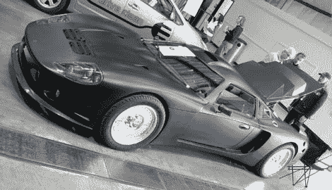
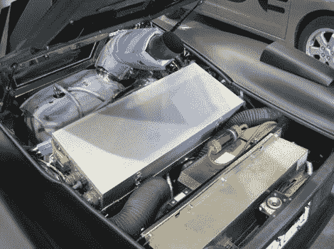
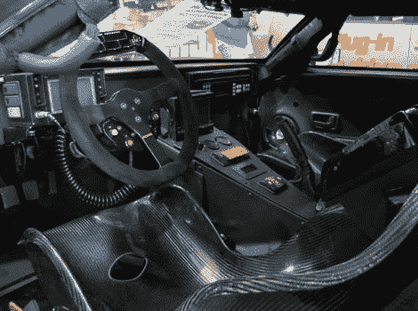
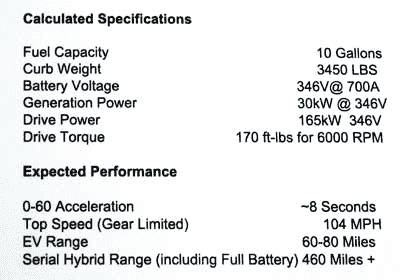

# BAMF2010: CMT 380X 黑鸟

> 原文：<https://hackaday.com/2010/05/23/bamf2010-cmt-380x-blackbird/>

好吧，我们撒谎了，我们也很想要一个。 [CMT 380X 黑鸟](http://www.capstoneturbine.com/news/story.asp?id=536)是一辆*缺德*的混合动力车！

黑鸟看起来像是刚从下一部《蝙蝠侠》电影的布景中推出的，是电子艺界首席创意总监理查德·希勒曼的创意。从一个工具包汽车基地开始——工厂五赛车 GTM 底盘——[hille man]创造了一个独特的 230 马力传动系统，结合了 30 千瓦柴油[涡轮](http://hackaday.com/2005/10/28/mini-gas-turbine-motorcycle/)和 24 千瓦时[锂聚合物](http://hackaday.com/2008/07/10/new-sparkfun-designs/)电池组。

作为一款纯插电式[电动车](http://hackaday.com/2006/10/19/electric-7-ev/)，黑鸟的续航里程为 85 英里。在[混合](http://hackaday.com/2009/10/07/hack-a-usb-port-into-your-2010-prius/)模式下，续航里程延长至 500 英里。这辆车能在 7 秒左右从 0 加速到 60。减速时，汽车利用再生制动。

就目前而言，这绝对是一次性的，但是已经有几家公司与[Hilleman]接触，讨论将这项设计商业化的可能性。休息之后还有几张精选照片…

