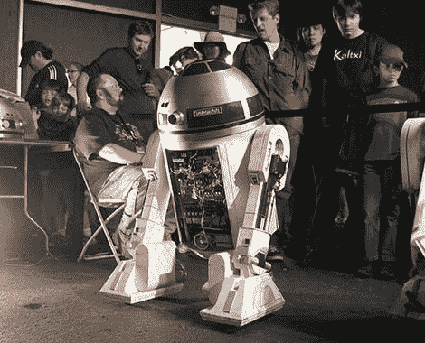
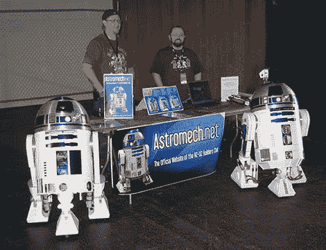
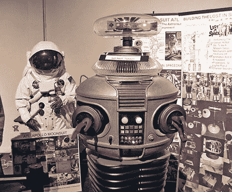
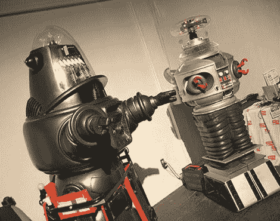

# 看，长官，机器人！

> 原文：<https://hackaday.com/2010/05/27/bamf2010-look-sir-droids/>

问任何一个工程师最初是什么激发了他们对技术的兴趣，几乎普遍的回答是好莱坞电影或电视机器人——*星球大战* R2-D2，来自*的 B9 机器人迷失太空*或*短路的* [强尼 5](http://hackaday.com/2008/08/23/vias-epia-pico-itx-based-robots/) 等等。工程师也需要一个创造性的出口，一些人通过建造精致的复制品来表达对他们灵感的敬意。在今年的 [Maker Faire](http://hackaday.com/2010/05/21/bay-area-maker-faire-blasts-off-saturday/) 上，机器人建造者在中心大厅有自己的角落，他们的作品从简陋的工艺材料到在细节和做工上超越电影同行的机器人。

可能有史以来最受欢迎的电影机器人将是 [R2-D2](http://hackaday.com/2010/03/10/r2d2-build-video/) ，最著名的复制品可能来自 [R2-D2 建筑者俱乐部](http://www.astromech.net/)，他们已经在 *[Make](http://www.make-digital.com/make/vol02/?pg=162#pg162)* 和 *[Servo](http://www.servomagazine.com/downloads.php)* 等杂志上被介绍过。每个孩子都梦想建造自己的 R2，也许是用废纸篓和废料，但俱乐部的宇航技工机器人绝不是小孩子的东西，它们有机械加工的铝制圆顶和复杂的马达和声音系统。俱乐部不卖机器人——那会侵犯商标——但是他们分享技术和部件计划。完工的机器人(它们真的完工了吗？)出席粉丝大会和慈善活动。

危险的威尔·罗宾逊！职业发明家[安德鲁·费罗]三十年来一直在设计实用的日常用品，但他通过将早期的灵感融入生活来放松自己。他精心研究的复制品包括阿波罗时代的美国国家航空航天局宇航服和一个会说话、会走路……呃，会滚动……的 B9 机器人。

自称隐居者的 ELS 是电影道具和复制品的建造者和收藏家。虽然他坚持说他的 Robby 和 B9 不是完美的经典，但你永远不会通过观察知道；这两件作品的细节和完成令人惊叹。罗比是可穿戴的，周末他会定期穿上西装[娱乐新一代](http://hackaday.com/2010/05/24/bay-area-maker-faire-2010-in-pictures/)，否则他们可能不熟悉这部好莱坞经典。

[Matthew Ebisu]对皮克斯的一切都很痴迷。作为参展的年轻制造商之一，[马修的]材料可能更简单，但他的热情远远填补了空白。他从*到*建造并推出了微型形式的卡尔·弗雷德里克森的房子。虽然没有到达南美，但他在内华达州找到了一个笔友。他的自动驾驶仪和来自*瓦力*的 Eve 机器人与其说是技术，不如说是工艺，所以他的最新项目，以及他在 [D.I.Y .皮克斯粉丝网站](http://reachsites.com/diypixar/)上的一群志同道合的朋友，是开发一个可以工作的瓦力机器人。

所以，读者们——有没有一个最受欢迎的好莱坞机器人来证明你们对这种疯狂黑客行为的热情？你造好了吗？你厨房里的 HAL-9000？请在评论中告诉我们，或者如果你在网上某处发布了构建日志，请在 tips@hackaday.com[给我们留下链接。](http://hackaday.com/contact-hack-a-day/)