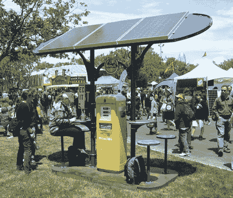

# BAMF2010:太阳能泵充电站

> 原文：<https://hackaday.com/2010/05/23/bamf2010-solarpump-charging-station/>

在 2010 年湾区制造商博览会上，在无数机器人和特斯拉线圈的噪音中，我们找到了一个可用 WiFi 的泡泡，并在附近充了电。如果这里没有其他内容，我们需要*这个:*

太阳能泵充电站是一个独立的绿洲，为笔记本电脑、手机甚至 T2 电动自行车提供免费电力。这个充电站是由得克萨斯州阳光[奥斯丁](http://hackaday.com/2008/10/19/maker-faire-austin-2008-in-pictures/)的 Sol 设计实验室创造的几个设计之一。不比一个公共汽车站大(而且看起来更酷)，它就像终极 [case mod](http://hackaday.com/2010/02/02/our-favorite-xbox-to-htpc-hacks/) ，重新利用一个老式 Citgo 气泵和回收金属来满足更现代的需求。三块大型三洋[太阳能电池板](http://hackaday.com/2008/09/14/60-watt-solar-panel-built-from-cells/)为设备提供电力，为用户提供遮荫，同时为内部 24V 100AH 电池充电，供夜间使用(带 LED 照明)或阴天使用。最终结果超越了“绿色”——太阳能泵只是在本能层面上吸引人，同时做到了有趣、有吸引力和实用。我们提过想要一个吗？我们*完全*想要一个。